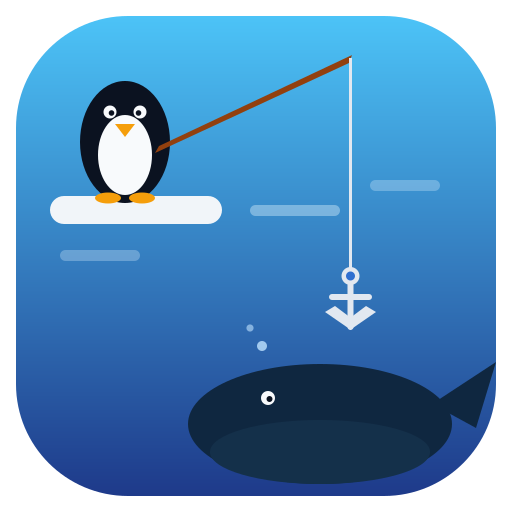
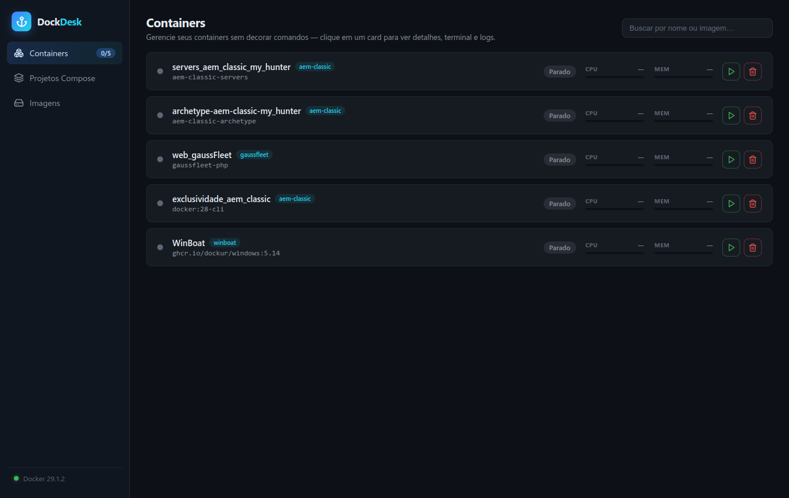

# DockDesk

**Docker sin memorizar comandos — una interfaz gráfica completa para Linux.**

<br clear="left"/>

🌐 [Português (BR)](../../README.md) · [English](README.en.md) · [中文](README.zh.md) · [हिन्दी](README.hi.md) · **Español** · [Français](README.fr.md)

---

## El dolor que resuelve

Todo equipo tiene ese proyecto que "solo hay que levantar con docker compose"… y alguien que se traba justo ahí.
Desarrolladores front-end, QAs, diseñadores técnicos, gente recién llegada al equipo: personas que **necesitan** containers a diario pero no quieren (ni deberían tener que) memorizar `docker exec -it`, flags de logs o el orden correcto para levantar los servicios.

DockDesk existe para ese público: **quien desarrolla en proyectos que usan Docker sin ser especialista en Docker**. Todo lo que exige el día a día está a un clic, con nombres claros, en seis idiomas — y sin esconder lo que pasa por debajo (los comandos equivalentes se muestran en la interfaz).

## Qué hace

### Contenedores
- Lista con estado en vivo, uso de **CPU y memoria**, puertos mapeados y búsqueda;
- **Iniciar, detener, reiniciar y eliminar** con un clic (la eliminación pide confirmación);
- Contenedores **agrupados por proyecto Compose** en acordeones — incluso proyectos levantados fuera de DockDesk — con estado abierto/plegado recordado y **reordenamiento por arrastre**;
- Panel de detalles: imagen, IP interna, redes, puertos, volúmenes/montajes y variables de entorno.

### Terminal y comandos
- **Terminal interactiva real** (equivalente a `docker exec -it`), con **detección automática de los shells** disponibles en la imagen (bash, zsh, fish, ash, sh…);
- **Ejecutar comando** suelto con salida, stderr y código de salida — sin abrir terminal;
- **Logs en vivo** con auto-scroll inteligente;
- Las pestañas preservan lo que está corriendo al alternar, con botones de limpiar.

### Rutinas (atajos por contenedor)
- Crea botones como `htop`, `npm run dev` o `composer install`;
- **Rutinas parciales**: el comando fijo (ej.: `cd /home/proyecto`) pide el complemento al ejecutar (ej.: `&& npm install`);
- Cada rutina corre en **su propia terminal anclada a su fila**, visible mientras el proceso vive — perfecto para `npm run dev` — con **indicador de ejecución** y botón de detener;
- Guardadas por nombre de contenedor: sobreviven a recreaciones.

### Proyectos Compose
- Apunta a la carpeta de tus proyectos y DockDesk **encuentra los `docker-compose.yml` solo** (hasta 4 niveles, ignorando `node_modules` y similares);
- **Levantar (`up -d`), bajar y reiniciar** con un clic, consola con salida en tiempo real y conteo de servicios corriendo;
- Botones contextuales: "Levantar" desaparece cuando todo está arriba; "Reiniciar/Bajar" solo aparecen con algo corriendo.

### Imágenes, volúmenes y redes
- Todos agrupados por su proyecto Compose, con acordeones reordenables;
- Eliminación protegida (avisa cuando el recurso está en uso);
- Las redes por defecto de Docker están marcadas y protegidas contra eliminación.

### Experiencia
- **Tema claro/oscuro** con un clic;
- **6 idiomas**: Português (BR), English, 中文, हिन्दी, Español y Français — interfaz y bandeja;
- **Bandeja del sistema**: cerrar esconde a la bandeja; opciones de iniciar con el sistema e iniciar oculto;
- **Instancia única**: abrir de nuevo solo enfoca la ventana existente;
- El orden de los grupos, tema, idioma y estado de los acordeones persisten entre sesiones.



## Instalación

Descarga el `.AppImage` más reciente en [Releases](https://github.com/vitormoreiradesenvolvedor/dockdesk-linux/releases), dale permiso de ejecución y córrelo:

```bash
chmod +x DockDesk-*.AppImage
./DockDesk-*.AppImage
```

**Requisitos:** Linux con Docker Engine corriendo y tu usuario en el grupo `docker`
(`sudo usermod -aG docker $USER`); Docker Compose v2 para el área de proyectos.

## Desarrollo

```bash
npm install          # también activa los hooks de git del proyecto
npm start            # build del renderer + abre la app
npm run test:e2e     # pruebas end-to-end (Playwright + Docker real)
npm run dist         # genera el AppImage en release/
```

- **Arquitectura:** `electron/` (proceso principal: Docker vía socket con dockerode, expuesto por `contextBridge`) · `src/` (React + TypeScript + Vite, terminal con xterm.js) · `tests/e2e/` (Playwright manejando la app real).
- **Flujo de git y gobernanza:** reglas de branches, commits, PRs y release automatizado en [docs/git/governanca.es.md](../git/governanca.es.md).
